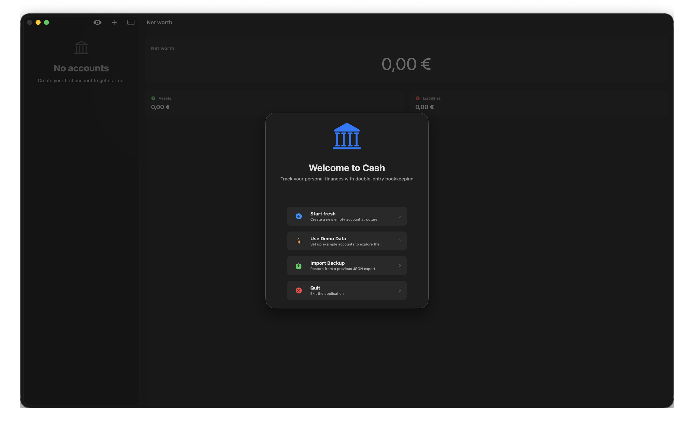

# Cash - Personal Finance Manager

A simplified macOS financial management application inspired by Gnucash, built with SwiftUI and SwiftData.

## Screenshots



See all screenshots [here](SCREENSHOT.md).

## Getting Started

### Prerequisites
- macOS 14.0 or later
- Xcode 15.0 or later
- Swift 5.9 or later

### Installation

1. Clone the repository:
```bash
git clone https://github.com/yourusername/cash.git
cd cash
```

2. Open the project in Xcode:
```bash
open Cash.xcodeproj
```

3. Build and run the project (⌘R)

## Build Configuration

### iCloud Sync (Optional)

iCloud sync is disabled by default. To enable it:

1. In Xcode, select the **Cash** target
2. Go to **Build Settings** → **Swift Compiler - Custom Flags**
3. Add `ENABLE_ICLOUD` to **Active Compilation Conditions** for the desired configuration (Debug/Release)

Or via command line:
```bash
xcodebuild -scheme Cash -configuration Release \
  SWIFT_ACTIVE_COMPILATION_CONDITIONS='$(inherited) ENABLE_ICLOUD' \
  build
```

**Requirements for iCloud:**
- Apple Developer account with CloudKit enabled
- Configure the iCloud container identifier in `Cash.entitlements`
- Sign the app with a valid provisioning profile
- Active subscription OR `ENABLE_PREMIUM` flag enabled

When iCloud is enabled, a new "iCloud" tab appears in Settings where users can enable/disable sync.

### Premium Features

Cash offers a freemium model with the following premium features available through subscription:

| Feature | Free | Premium |
|---------|------|---------|
| **iCloud Sync** | ❌ | ✅ |
| **Budgeting** | ❌ | ✅ |
| **Advanced Reports** | ❌ | ✅ |
| **Loans & Mortgages** | ❌ | ✅ |
| **Accounts** | Up to 5 | Unlimited |
| **Categories** | Up to 10 | Unlimited |
| **Scheduled Transactions** | Up to 5 | Unlimited |

### Premium Features (Development)

For development and testing, you can enable all premium features without a subscription:

1. In Xcode, select the **Cash** target
2. Go to **Build Settings** → **Swift Compiler - Custom Flags**
3. Add `ENABLE_PREMIUM` to **Active Compilation Conditions** for Debug configuration

Or via command line:
```bash
xcodebuild -scheme Cash -configuration Debug \
  SWIFT_ACTIVE_COMPILATION_CONDITIONS='$(inherited) ENABLE_ICLOUD ENABLE_PREMIUM' \
  build
```

When `ENABLE_PREMIUM` is set, all premium features are unlocked regardless of subscription status. The Settings subscription tab will show a "DEV" badge to indicate development mode.

### In-App Purchases Setup

To test in-app purchases:

1. The project includes a StoreKit Configuration file (`Cash/Resources/Products.storekit`)
2. Configure the scheme to use the StoreKit Configuration (Edit Scheme → Run → Options → StoreKit Configuration)
3. Select `Products.storekit` from the dropdown

Subscription products:
- `com.thesmokinator.cash.premium.monthly` - Monthly Premium ($2.99/month)
- `com.thesmokinator.cash.premium.yearly` - Yearly Premium ($24.99/year, ~30% savings)

## Development

### Resetting the Data Store

If you need to reset the application data (e.g., after schema changes during development), delete the SwiftData store:

```bash
rm -rf ~/Library/Application\ Support/Cash
rm -rf ~/Library/Containers/com.thesmokinator.Cash/Data/Library/Application\ Support/Cash
```

Then restart the application. The setup wizard will appear to create new default accounts.

## Localization

Cash is fully localized in:
- 🇬🇧 English
- 🇮🇹 Italian
- 🇪🇸 Spanish
- 🇫🇷 French
- 🇩🇪 German

Language can be changed on-the-fly in Settings without restarting the app.

To add a new language, edit `Localizable.xcstrings` in Xcode.

## Data Persistence

All data is stored locally using SwiftData. When iCloud sync is enabled (build flag + user preference), data syncs across devices via CloudKit.

## Contributing

We welcome contributions! Please read our [Contributing Guidelines](CONTRIBUTING.md) and [Code of Conduct](CODE_OF_CONDUCT.md) before submitting a Pull Request.

## License

This project is licensed under the MIT License - see the LICENSE file for details.
